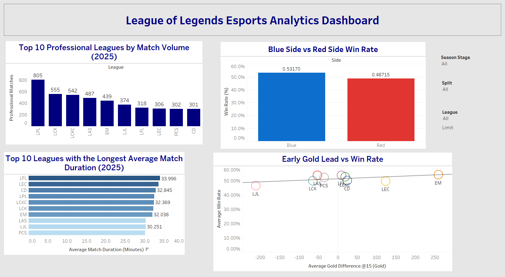
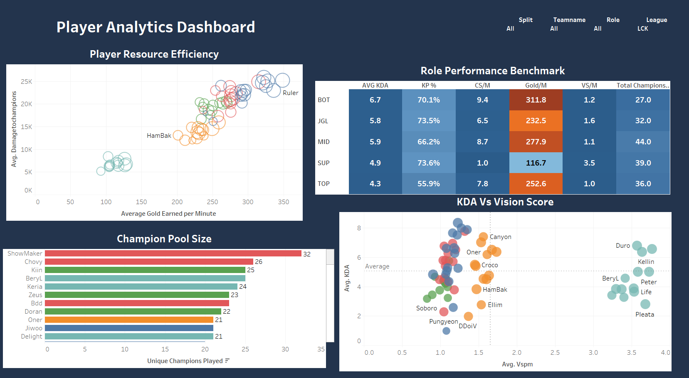
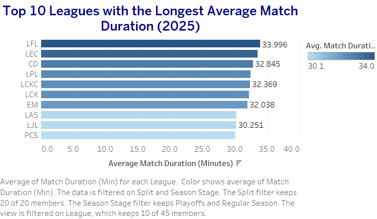
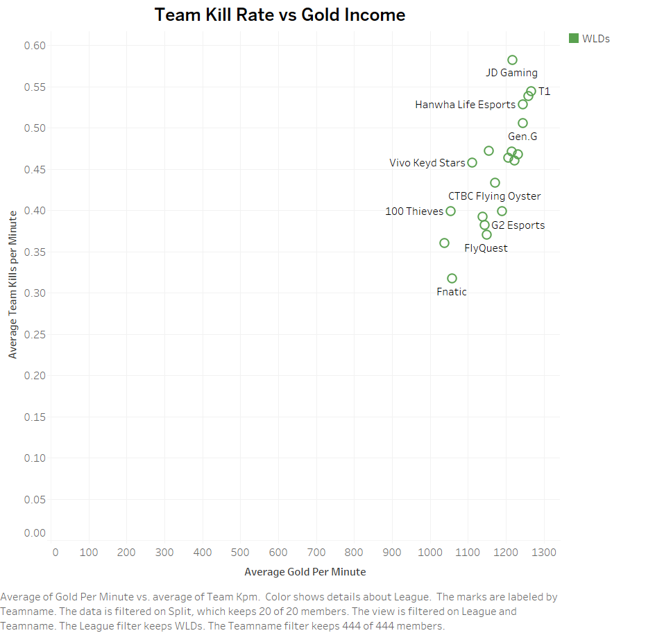
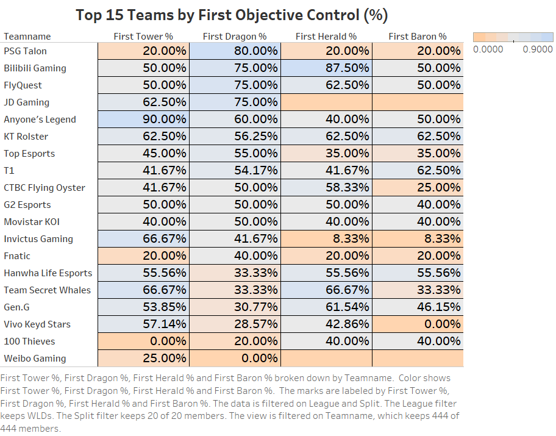
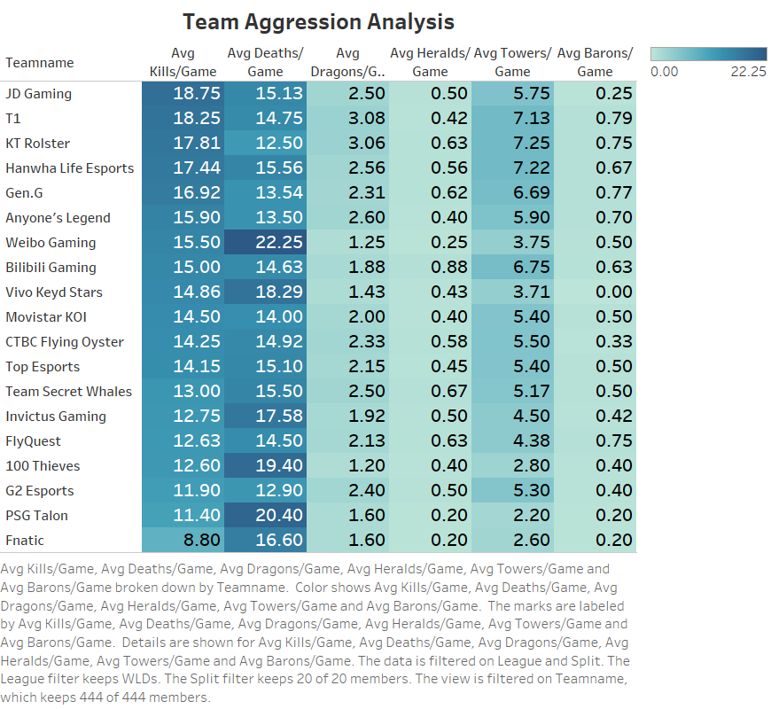
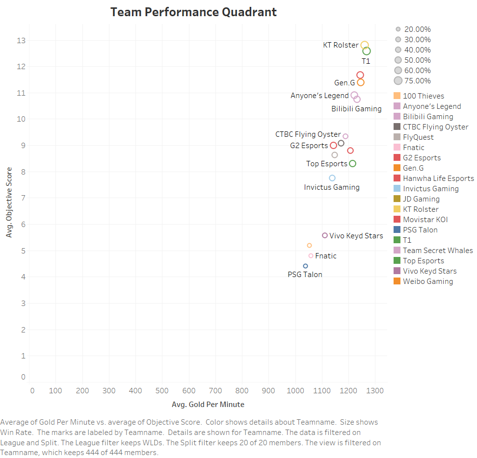
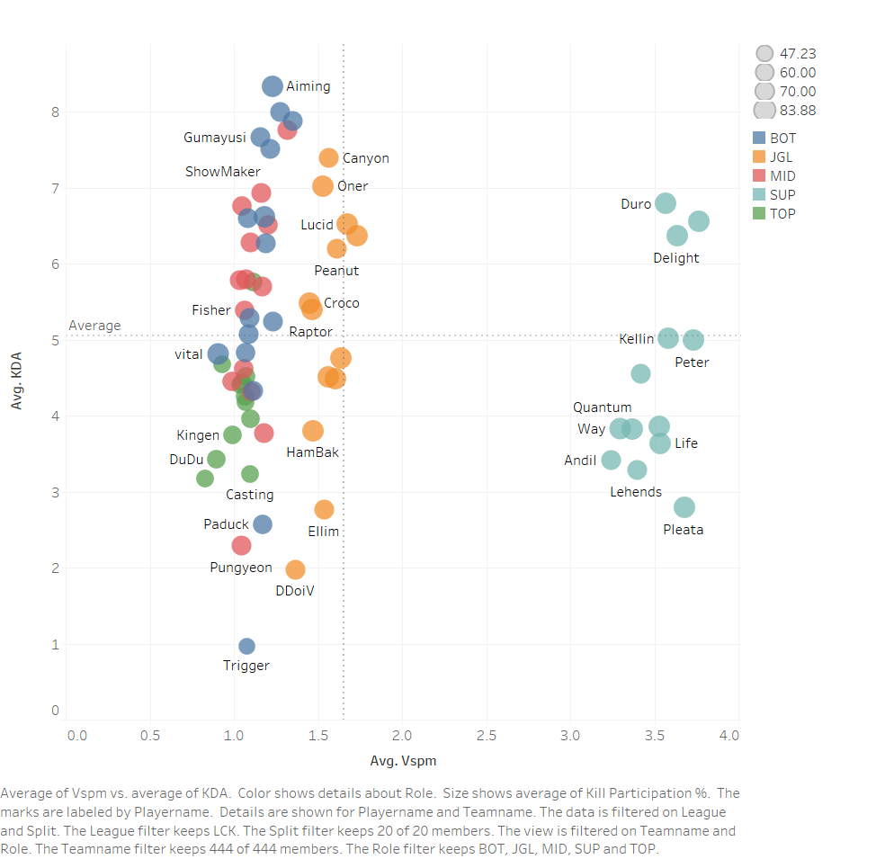
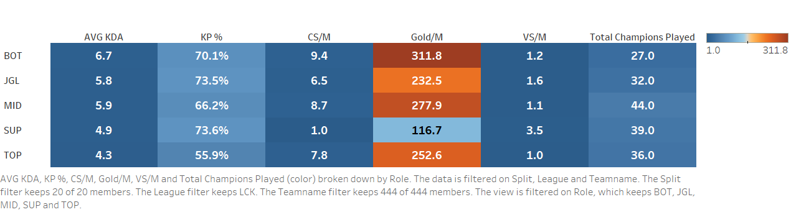

# League2025-Analytics

## Project Overview

League2025-Analytics is a Tableau data visualization project that explores the professional League of Legends 2025 esports season. The project analyzes league trends, team performance, and player statistics through a collection of interactive dashboards and visualizations.

The dashboards are designed to uncover insights related to match activity, objective control, resource efficiency, player performance, and overall competitive trends using Tableau.

---

## Dataset

The dataset contains professional League of Legends match statistics from the 2025 competitive season.

The analysis includes:

- Match-level statistics
- Team performance metrics
- Player performance metrics
- Gold economy
- Objective control
- Vision statistics
- Champion pool analysis
- Kill participation
- KDA and resource efficiency

---

## Tools Used

- Tableau Desktop
- Tableau Public
- GitHub
- Microsoft Excel (Data Preparation)

---


## Repository Structure

```
League2025-Analytics/
│
├── Dataset/              # Source dataset
├── Screenshots/          # Dashboard and worksheet screenshots
├── Tableau/              # Tableau workbook (.twbx)
└── README.md             # Project documentation
```

## Tableau Public Dashboard

https://public.tableau.com/views/League2025DataAnalysis_Final/LeagueofLegends2025EsportsAnalytics

---

# Dashboard Screenshots

## Story Overview



---

## Match Analytics Dashboard


---

## Team Analytics Dashboard


---

## Player Analytics Dashboard



---

# Individual Worksheets

## WS01 – Match Volume


---

## WS02 – Blue Side Advantage


---

## WS03 – Average Match Duration



---

## WS04 – Early Gold Lead vs Win Rate


---

## WS05 – Team Kill Rate vs Gold Income



---

## WS06 – First Objective Control



---

## WS07 – Team Aggression Profile



---

## WS08 – Team Performance Quadrant



---

## WS09 – Player Resource Efficiency


---

## WS10 – Champion Pool Size


---

## WS11 – KDA vs Vision Impact



---

## WS12 – Role Performance Benchmark



---

## Key Insights

- LPL recorded the highest professional match volume during the 2025 season.
- Blue Side maintained a slightly higher overall win rate than Red Side.
- Teams securing an early gold advantage generally achieved higher win rates.
- Strong objective control showed a positive relationship with overall team performance.
- Players with larger champion pools demonstrated greater versatility across the season.
- Vision score and KDA exhibited a positive relationship, particularly for support-oriented roles.
- Resource efficiency varied significantly across different player roles.

---

## Author

**Affaan Arbani**

GitHub: https://github.com/AffaanArbani

Tableau Public:
https://public.tableau.com/views/League2025DataAnalysis_Final/LeagueofLegends2025EsportsAnalytics