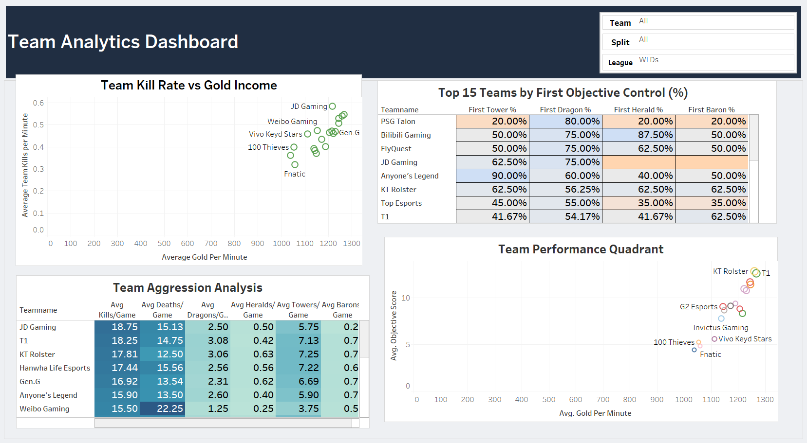
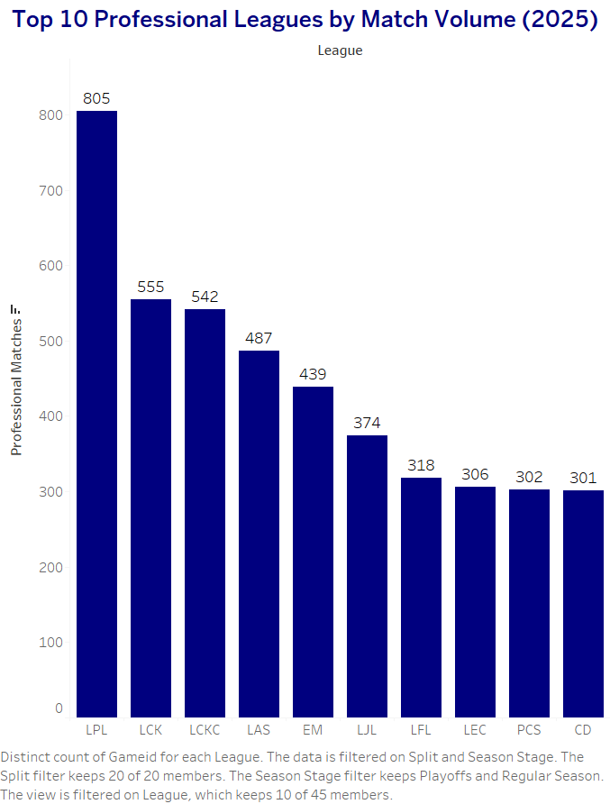
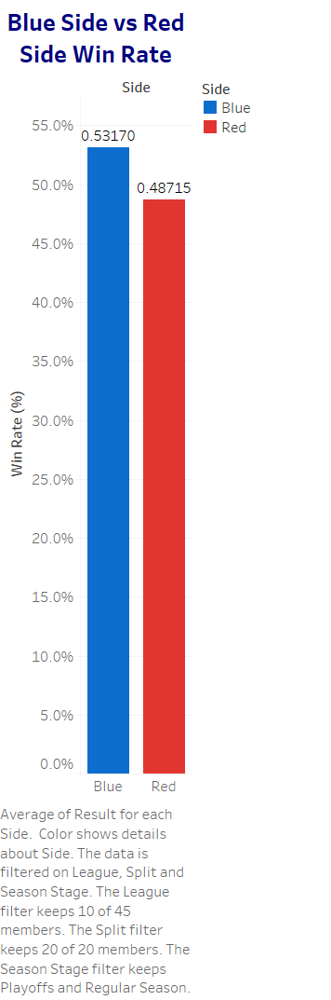
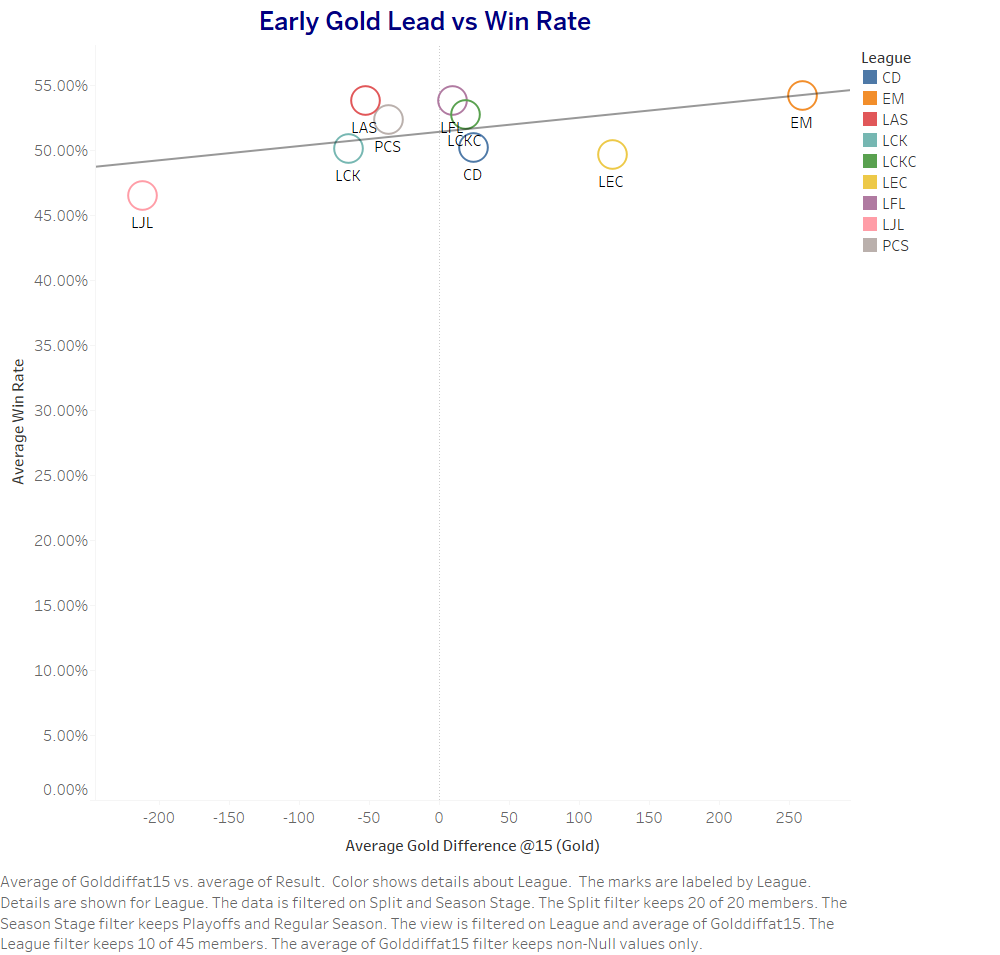
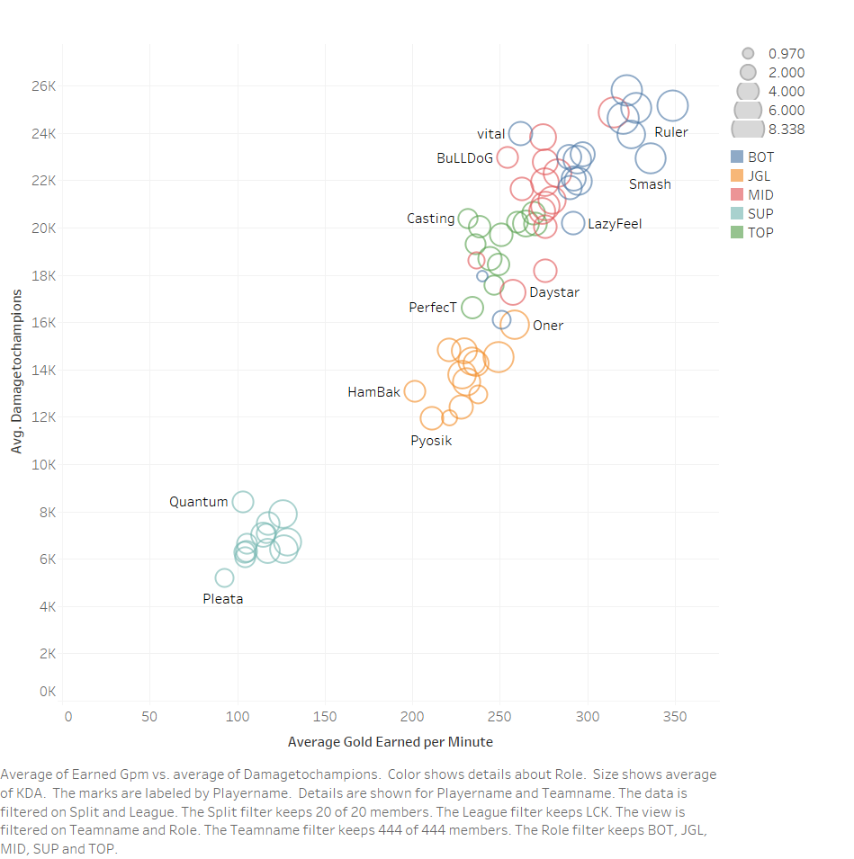
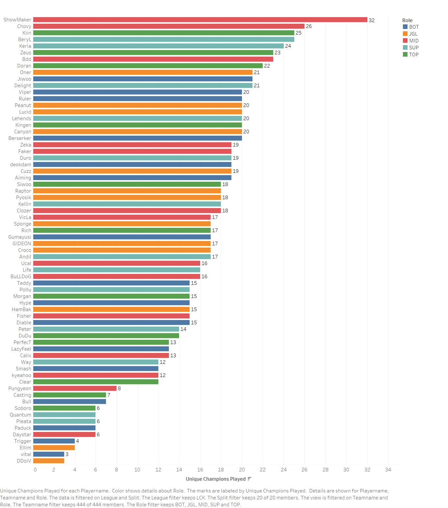

# League of Legends 2025 Esports Analytics

## Project Overview

This project was developed as part of the **PGCP-BDA (Post Graduate Certificate Program in Big Data Analytics)**. The objective was to analyze the professional League of Legends 2025 competitive season using Tableau and create interactive dashboards that provide insights into league performance, team statistics, and player performance.

The project combines multiple datasets to explore match outcomes, objective control, player efficiency, resource management, and overall competitive trends through interactive visualizations.

---

## Objectives

- Analyze professional League of Legends esports data.
- Compare league performance across different regions.
- Evaluate team aggression, objective control, and economy.
- Measure player efficiency using performance metrics.
- Build interactive Tableau dashboards with filters and drill-down capabilities.
- Publish the project using Tableau Public and GitHub.

---

## Tools & Technologies

- Tableau Desktop
- Tableau Public
- Git & GitHub
- CSV Datasets

---

## Dataset

The project uses three datasets:

- Match Analytics
- Team Analytics
- Player Analytics

These datasets include information such as:

- Match statistics
- League information
- Team performance metrics
- Player performance metrics
- Gold and resource statistics
- Vision score
- KDA
- Objective control
- Champion pool statistics

---

## Dashboards

### 1. Match Analytics Dashboard

Provides an overview of the professional 2025 competitive season by analyzing:

- Match volume across leagues
- Blue Side vs Red Side win rate
- Average match duration
- Early gold lead vs win rate

---

### 2. Team Analytics Dashboard

Focuses on team performance using metrics such as:

- Team kill rate vs gold income
- First objective control
- Team aggression profile
- Team performance quadrant

---

### 3. Player Analytics Dashboard

Analyzes individual player performance through:

- Resource efficiency
- Champion pool size
- Vision score vs KDA
- Role performance benchmark

---

## Tableau Story

A Tableau Story combines all three dashboards into a guided analytical report, allowing users to navigate through:

- Overview
- Team Analytics
- Player Analytics

---

## Interactive Dashboard

Tableau Public:

https://public.tableau.com/views/League2025DataAnalysis_Final/LeagueofLegends2025EsportsAnalytics

---

## Repository Structure

```
League2025-Analytics
│
├── Dataset
│   ├── Match_Analytics.csv
│   ├── Team_Analytics.csv
│   └── Player_Analytics.csv
│
├── Screenshots
│   ├── Dashboard Images
│   └── Worksheet Images
│
├── Tableau
│   └── League2025DataAnalysis_Final.twbx
│
└── README.md
```

---

## Screenshots

### Match Analytics Dashboard


---

### Team Analytics Dashboard



---

### Player Analytics Dashboard


---

## Individual Worksheets

### WS01 - Top Professional Leagues by Match Volume



### WS02 - Blue Side Advantage



### WS03 - Average Match Duration


### WS04 - Early Gold Lead vs Win Rate



### WS05 - Team Kill Rate vs Gold Income


### WS06 - First Objective Control

.png)

### WS07 - Team Aggression Profile

.png)

### WS08 - Team Performance Quadrant


### WS09 - Player Resource Efficiency



### WS10 - Champion Pool Size



### WS11 - KDA vs Vision Impact


### WS12 - Role Performance Benchmark


---

## Author

**Affaan Arbani**

PGCP-BDA

GitHub: https://github.com/AffaanArbani

Tableau Public: https://public.tableau.com/views/League2025DataAnalysis_Final/LeagueofLegends2025EsportsAnalytics